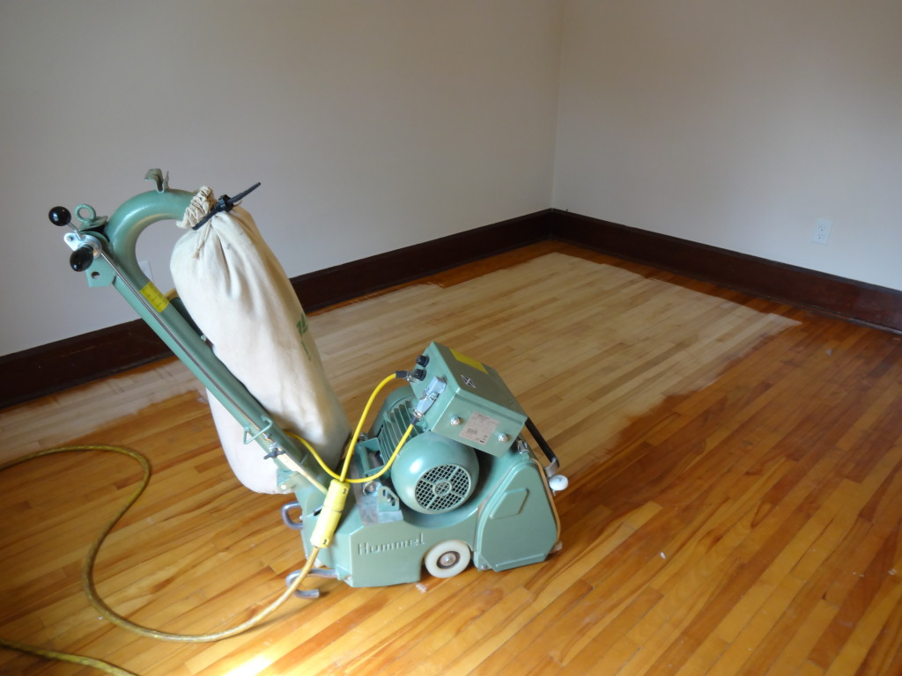

Using the best equipment often leads to doing the best work. At Woodworks, we don't mess around. Our main floor sander is the Lagler Hummel, pictured below.

The reason we chose this machine is because it gives the flattest and most precise cuts, which means you get the flastest floor.

### Technical Data of the Hummel

| Single-phase AC motor Size | 220 V |
| Amperage Needed | min. 30 A |
| Drum Width | 200 mm (7 7/8″) |
| Drum Speed | 2880 rpm |
| Belt Dimensions | 200 x 750 mm —- (7 7/8″ x 29 1/2″) |
| Machine weight | 174 lbs |